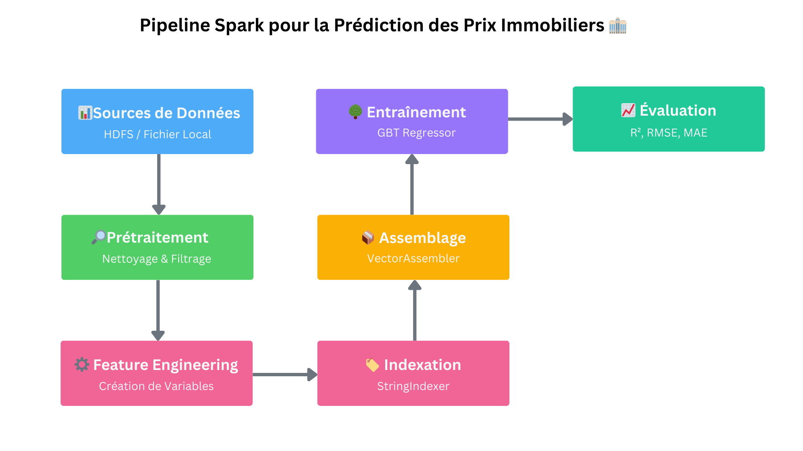
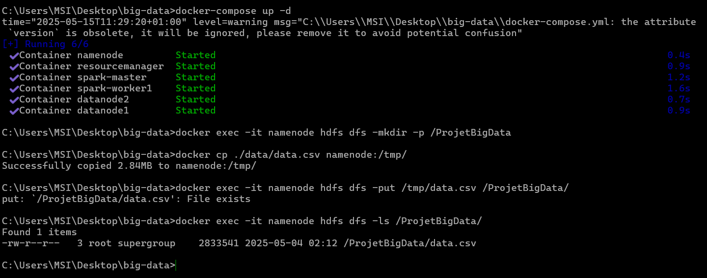
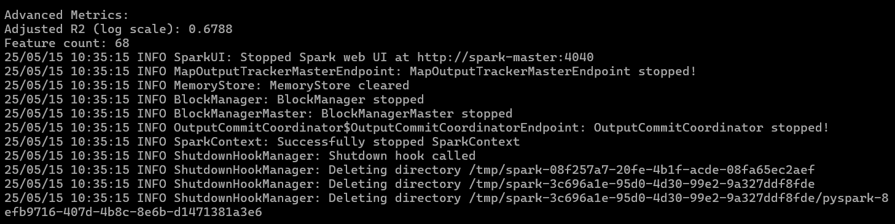

# 🏡 Prédiction des Prix Immobiliers avec PySpark 🚀

Ce projet implémente un modèle de prédiction des prix immobiliers utilisant PySpark et l'algorithme Gradient Boosted Trees (GBT). Il démontre l'adaptation d'un modèle XGBoost vers l'écosystème Spark pour permettre le traitement distribué et le passage à l'échelle.

## 📋 Aperçu du Projet



Le projet comprend:
- Un modèle de prédiction des prix immobiliers basé sur PySpark ML
- Un pipeline Spark complet pour le prétraitement, le feature engineering et l'entraînement
- Des améliorations techniques pour maximiser la précision (R² = 0.6918)
- Une architecture distribuée pour le traitement de grands volumes de données

## 🔧 Structure du Projet

```
├── docker-compose.yml          # Configuration de l'environnement distribué
├── Dockerfile                  # Image personnalisée avec les dépendances ML
├── scripts/                    # Scripts d'exécution et d'analyse
│   ├── spark_gbt_basic.py      # Implémentation GBT simple (R² = 0.6855)
│   └── spark_gbt_optimized.py  # Implémentation GBT optimisée (R² = 0.6918)
├── data/                       # Données immobilières
│   └── data.csv                # Dataset des propriétés (8774 observations)
├── rapport.md                  # Rapport détaillé du projet
└── README.md                   # Ce fichier
```

## 🌟 Caractéristiques Principales

- **Feature Engineering Avancé**: Création de variables quadratiques, ratios et interactions
- **Optimisation des Hyperparamètres**: Configuration fine du GBT pour maximiser le R²
- **Traitement des Valeurs Aberrantes**: Filtrage intelligents des prix extrêmes
- **Pipeline Spark Complet**: Workflow reproductible de bout en bout
- **Environnement Containerisé**: Configuration Docker prête à l'emploi

## 📊 Résultats

| Modèle              | R² (échelle log) | R² (échelle originale) | RMSE             |
|---------------------|------------------|------------------------|------------------|
| GBT Simple          | 0.6855           | 0.6614                 | 182 213.6692     |
| GBT Optimisé        | 0.6918           | 0.6635                 | 181 638.4601     |
| XGBoost (référence) | 0.7560           | 0.7390                 | 157 288.7441     |

Le modèle GBT optimisé atteint 91.5% des performances du modèle XGBoost original (échelle log) et 89.8% sur l'échelle originale, tout en offrant les avantages du traitement distribué.

## 🚀 Installation et Exécution

### Prérequis
- Docker & Docker Compose
- Git

### Configuration

1. Cloner le dépôt:
```bash
git clone https://github.com/MarouaHattab/Big-Data-Price-Prediction
cd prediction-prix-immobiliers
```

2. Construire l'image Docker personnalisée:
```bash
docker build -t custom-spark:latest .
```

3. Lancer l'environnement distribué:
```bash
docker-compose up -d
```

### Préparation des données dans HDFS

1. Créer le répertoire de projet dans HDFS:
```bash
docker exec -it namenode hdfs dfs -mkdir -p /ProjetBigData
```

2. Copier le dataset CSV vers le container namenode:
```bash
docker cp ./data/data.csv namenode:/tmp/
```

3. Copier le dataset depuis le container vers HDFS:
```bash
docker exec -it namenode hdfs dfs -put /tmp/data.csv /ProjetBigData/
```

4. Vérifier que le fichier est bien copié:
```bash
docker exec -it namenode hdfs dfs -ls /ProjetBigData/
```

### Préparation du script Python

1. Copier le script Python optimisé vers le container Spark:
```bash
docker cp ./scripts/spark_gbt_optimized.py spark-master:/tmp/spark.py
```

2. Vérifier que le script est bien copié:
```bash
docker exec -it spark-master ls -la /tmp/
```

### Exécution du pipeline

```bash
docker exec -it spark-master /opt/bitnami/spark/bin/spark-submit --master local[*] --conf spark.executor.memory=2g --conf spark.driver.memory=2g /tmp/spark.py
```

### Suivre l'exécution

Vous pouvez suivre l'exécution du job via l'interface web Spark:
- Spark UI: http://localhost:8080
- Application UI: http://localhost:4040 (pendant l'exécution)
- HDFS UI: http://localhost:9870

### Récupérer les résultats

Si votre script écrit des résultats dans HDFS:
```bash
# Créer le répertoire pour les résultats
docker exec -it namenode hdfs dfs -mkdir -p /ProjetBigData/results

# Copier les résultats depuis HDFS
docker exec -it namenode hdfs dfs -get /ProjetBigData/results ./results
```

## 📈 Visualisations et Métriques

Les principales caractéristiques prédictives sont:
- `neighborhood_encoded` (0.1177) - L'emplacement reste roi!
- `bath_living` (0.0879) - L'interaction surface/salle de bain
- `city_encoded` (0.0681) - La ville où se trouve la propriété
- `area_per_bedroom` (0.0603) - La surface par chambre
- `living_land_ratio` (0.0526) - Le ratio bâti/terrain

## 🧩 Adaptation à d'autres datasets

Le pipeline est facilement adaptable à d'autres jeux de données immobiliers:

1. Remplacer le fichier CSV dans le dossier data/
```bash
# Copier un nouveau dataset
cp /chemin/vers/nouveau/dataset.csv ./data/

# Mettre à jour HDFS
docker exec -it namenode hdfs dfs -rm /ProjetBigData/data.csv
docker cp ./data/dataset.csv namenode:/tmp/
docker exec -it namenode hdfs dfs -put /tmp/dataset.csv /ProjetBigData/data.csv
```

2. Ajuster les noms de colonnes dans le script si nécessaire
```bash
# Modifier le script
nano ./scripts/spark_gbt_optimized.py

# Mettre à jour le script dans le container
docker cp ./scripts/spark_gbt_optimized.py spark-master:/tmp/spark.py
```

3. Relancer l'exécution avec spark-submit
```bash
docker exec -it spark-master /opt/bitnami/spark/bin/spark-submit --master local[*] /tmp/spark.py
```


## 📜 Rapport Complet
Le rapport détaillé du projet est disponible [ici](rapport.md). Il couvre les étapes de prétraitement, le feature engineering, l'entraînement du modèle et l'évaluation des performances.
## 📚 Ressources
- [Documentation PySpark](https://spark.apache.org/docs/latest/api/python/index.html)
- [Documentation Spark ML](https://spark.apache.org/docs/latest/ml-guide.html)
- [Documentation Docker](https://docs.docker.com/)
- [Documentation Docker Compose](https://docs.docker.com/compose/)
- [Documentation HDFS](https://hadoop.apache.org/docs/stable/hadoop-project-dist/hadoop-hdfs/HdfsCommands.html)
- [Documentation XGBoost](https://xgboost.readthedocs.io/en/latest/)
- [Documentation Gradient Boosted Trees](https://spark.apache.org/docs/latest/ml-classification-regression.html#gradient-boosted-trees-gbt)
- [Documentation Feature Engineering](https://spark.apache.org/docs/latest/ml-features.html)
- [Documentation Feature Importance](https://spark.apache.org/docs/latest/api/python/reference/pyspark.ml.html#pyspark.ml.feature.FeatureImportance)
- [Documentation Hyperparameter Tuning](https://spark.apache.org/docs/latest/api/python/reference/pyspark.ml.html#pyspark.ml.tuning.HyperparameterTuning)

## 👨‍💻 Contributeurs

- [Maroua HATTAB](https://github.com/MarouaHattab)

