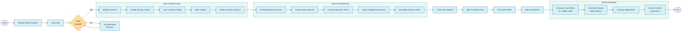

```mermaid
flowchart LR
    classDef process fill:#d4f1f9,stroke:#05386b,stroke-width:1px
    classDef decision fill:#ffda9e,stroke:#d68910,stroke-width:1px
    classDef subgraph_style fill:#e8f8f5,stroke:#138d75,stroke-width:1px
    
    A([Start]) --> B[Initialize Spark Session]:::process
    B --> C[Load Data]:::process
    C --> D{Data<br>Loaded?}:::decision
    D -->|No| E[Try Alternative<br>Sources]:::process
    E --> D
    D -->|Yes| F[Identify Columns]:::process
    
    subgraph Preprocessing [Data Preprocessing]
        F --> G[Handle Missing Values]:::process
        G --> H[Log Transform Target]:::process
        H --> I[Filter Outliers]:::process
        I --> J[Define Feature Columns]:::process
    end
    
    subgraph FeatureEng [Feature Engineering]
        K[Create Squared Features]:::process --> L[Create Ratio Features]:::process
        L --> M[Create Interaction Terms]:::process
        M --> N[Index Categorical Features]:::process
        N --> O[Assemble Feature Vector]:::process
    end
    
    J --> K
    
    O --> P[Create ML Pipeline]:::process
    P --> Q[Split Train/Test Data]:::process
    Q --> R[Train GBT Model]:::process
    R --> S[Make Predictions]:::process
    
    subgraph Evaluation [Model Evaluation]
        T[Calculate Log Metrics<br>R², RMSE, MAE]:::process --> U[Calculate Original<br>Scale Metrics]:::process
        U --> V[Compute Adjusted R²]:::process
        V --> W[Extract Feature<br>Importance]:::process
    end
    
    S --> T
    W --> Z([End])
    
    class Preprocessing,FeatureEng,Evaluation subgraph_style
``` 