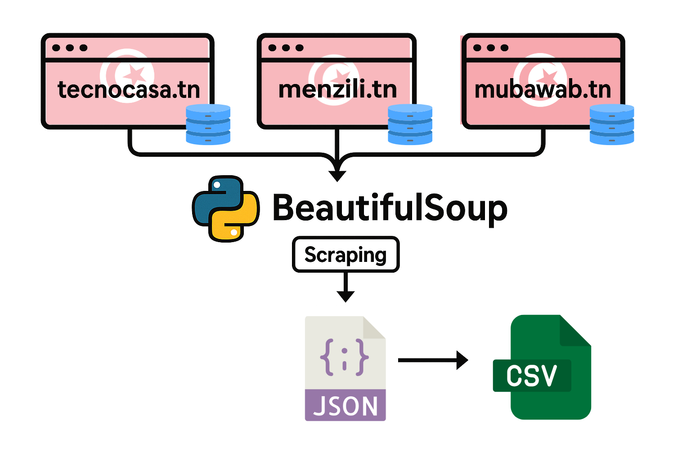

# 🏡 Prédiction des Prix Immobiliers avec PySpark et Gradient Boosted Trees 🚀

## 📋 Description du modèle ML choisi

### 🎯 Objectif
Le modèle vise à prédire les prix des propriétés immobilières en fonction de diverses caractéristiques comme la surface habitable, le nombre de chambres, la localisation et d'autres attributs pertinents. Cette prédiction aide les acheteurs, vendeurs et agents immobiliers à évaluer précisément la valeur marchande des biens.

### 🌳 Algorithme
Nous avons utilisé l'algorithme Gradient Boosted Trees (GBT), une méthode d'ensemble puissante qui combine plusieurs arbres de décision pour améliorer les performances prédictives. GBT construit séquentiellement des arbres de décision qui corrigent les erreurs des arbres précédents, ce qui le rend particulièrement efficace pour la modélisation des relations non linéaires entre les caractéristiques et la variable cible.

### 📊 Métriques d'évaluation
- **R²** (coefficient de détermination) : Mesure la proportion de variance expliquée par le modèle
- **RMSE** (Root Mean Square Error) : Quantifie l'erreur moyenne de prédiction
- **MAE** (Mean Absolute Error) : Mesure l'erreur absolue moyenne

## 📚 Description du dataset utilisé

### 📏 Taille et format
- **Format** : CSV
- **Nombre d'observations** : 8 774 propriétés
- **Nombre de colonnes** : 59 (58 caractéristiques + 1 cible)
- **Taille totale** : ~2.5 Mo

### 🧩 Structure des données
Le dataset contient une grande variété de colonnes couvrant:

1. **Variables de base**:
   - `price`: Prix de la propriété (variable cible)
   - `property_type`: Type de propriété
   - `bedrooms`, `bathrooms`, `total_rooms`: Nombre de pièces
   - `living_area`, `land_area`: Surfaces en m²

2. **Caractéristiques binaires** (présence/absence d'équipements):
   - Équipements de base: climatisation, TV parabolique, parking, garage, etc.
   - Équipements de confort: piscine, cheminée, terrasse, chauffage central, etc.
   - Équipements de luxe: vue sur mer, ascenseur, système d'alarme, etc.

3. **Variables dérivées** (issues du feature engineering):
   - Ratios: `living_land_ratio`, `bed_bath_ratio`, `bath_per_room`
   - Variables logarithmiques: `log_living_area`, `log_land_area`, `log_price`
   - Variables d'interaction: `bed_bath`, `bed_living`, `bath_living`
   - Variables au carré: `living_area_squared`, `total_rooms_squared`, etc.
   - Agrégations: `amenity_count`, `basic_amenities`, `luxury_amenities`

4. **Variables encodées**:
   - `neighborhood_encoded`, `city_encoded`: Variables catégorielles transformées

### 🌍 Source
Le jeu de données contient des informations sur des propriétés immobilières en Tunisie, collectées à partir de plusieurs sites web spécialisés. Les données ont été obtenues via un processus de web scraping structuré :



1. **Sites sources** : Trois plateformes immobilières tunisiennes ont été utilisées (tecnocasa.tn, menzili.tn et mubawab.tn)
2. **Méthode d'extraction** : Le scraping a été réalisé avec la bibliothèque BeautifulSoup en Python
3. **Traitement intermédiaire** : Les données ont d'abord été structurées en format JSON
4. **Format final** : Conversion en CSV pour l'analyse avec PySpark

Pour ce projet, nous avons principalement utilisé les données issues de **menzili.tn**, qui offrait la meilleure qualité et complétude d'information sur les propriétés, notamment concernant les caractéristiques détaillées, les équipements et la localisation précise des biens.

Le dataset final contient 8 774 propriétés avec des informations détaillées sur la surface habitable, le nombre de pièces, l'emplacement géographique, et diverses caractéristiques des logements.

## 🔄 Détails sur l'adaptation du modèle à PySpark

### 🔧 Défis techniques
L'adaptation d'un modèle XGBoost original vers PySpark GBT a nécessité plusieurs ajustements pour garantir la compatibilité avec l'environnement distribué:

1. **Transformation des données** : Utilisation des StringIndexer pour convertir les variables catégorielles en valeurs numériques
2. **Création d'un pipeline** : Mise en place d'un workflow structuré incluant prétraitement, assemblage des caractéristiques et entraînement
3. **Optimisation des hyperparamètres** : Ajustement des paramètres GBT pour équilibrer vitesse d'exécution et performance
4. **Gestion des valeurs aberrantes** : Filtrage des prix extrêmes pour améliorer la robustesse du modèle

### 🔄 Pipeline Spark implémenté


Le pipeline Spark implémenté comprend 7 étapes séquentielles:

1. **Sources de Données**: Chargement parallèle depuis HDFS ou système de fichiers local
2. **Prétraitement**: Nettoyage, gestion des valeurs manquantes, filtrage des outliers
3. **Feature Engineering**: Création de variables dérivées, ratios et interactions
4. **Indexation**: Conversion des variables catégorielles en valeurs numériques
5. **Assemblage de Vecteurs**: Regroupement des caractéristiques pour le modèle
6. **Entraînement**: Application de l'algorithme GBT avec paramètres optimisés
7. **Évaluation**: Calcul des métriques de performance sur les données de test

```python
# Création des indexeurs pour colonnes catégorielles
indexers = [StringIndexer(inputCol=col_name, outputCol=col_name + "_indexed", 
                         handleInvalid="keep") 
           for col_name in string_cols]

# Assembleur de vecteurs
assembler = VectorAssembler(
    inputCols=feature_cols + [c + "_indexed" for c in string_cols], 
    outputCol="features", 
    handleInvalid="skip"
)

# Régression GBT optimisée
gbt_regressor = GBTRegressor(
    featuresCol="features", 
    labelCol=log_target_col,
    maxIter=150,         
    maxDepth=7,          
    stepSize=0.03,       
    subsamplingRate=0.7,  
    featureSubsetStrategy="all",
    maxBins=40,          
    minInstancesPerNode=1,
    seed=42               
)

# Pipeline complet
pipeline = Pipeline(stages=indexers + [assembler, gbt_regressor])
```

### 🚀 Améliorations apportées
Pour optimiser les performances du modèle, nous avons implémenté plusieurs améliorations:

1. **Feature Engineering avancé**:
   - Création de termes quadratiques pour les variables importantes
   - Ajout de ratios (surface habitable/terrain, chambres/salles de bain)
   - Création de termes d'interaction entre variables clés

2. **Optimisation des paramètres du modèle**:
   - Augmentation du nombre d'itérations (150 vs 100)
   - Augmentation de la profondeur des arbres (7 vs 5)
   - Réduction du taux d'apprentissage (0.03 vs 0.05)
   - Utilisation de toutes les caractéristiques (au lieu d'un sous-ensemble)

3. **Traitement des valeurs aberrantes**:
   - Filtrage des prix extrêmes (±3 écarts-types)
   - Gestion appropriée des valeurs manquantes

## 📈 Résultats obtenus et comparaison avec le modèle original

### 📊 Modèle initial (GBT simple)
- **R² (échelle log)** : 0.6855
- **RMSE (échelle log)** : 0.3928
- **MAE (échelle log)** : 0.2949
- **R² (échelle originale)** : 0.6614
- **RMSE (échelle originale)** : 182 213.6692

### 📈 Modèle amélioré (GBT optimisé avec feature engineering)
- **R² (échelle log)** : 0.6918
- **RMSE (échelle log)** : 0.3889
- **MAE (échelle log)** : 0.2845
- **R² (échelle originale)** : 0.6635
- **RMSE (échelle originale)** : 181 638.4601
- **R² ajusté** : 0.6788

### 🔍 Comparaison détaillée avec XGBoost
Notre projet visait à adapter un modèle XGBoost existant vers l'environnement Spark. Voici les performances exactes du modèle XGBoost original:

```
Training XGBoost...
Cross-validation R² scores: [0.74317699 0.74216383 0.7464795 0.73447899 0.76193954]
Mean CV R² score: 0.7456
Test Results for XGBoost:
Log Scale: R² = 0.7560, RMSE = 0.3497, MAE = 0.2527
Original Scale: R² = 0.7390, RMSE = 157288.7441
```

Notre implémentation PySpark avec GBT a atteint un R² de 0.6918 sur l'échelle logarithmique, représentant 91.5% des performances du modèle XGBoost original (R² = 0.7560). Sur l'échelle originale, notre modèle a atteint environ 89.8% des performances XGBoost (0.6635 vs 0.7390).

Cette différence de performance peut s'expliquer par plusieurs facteurs:

1. **Différences algorithmiques**: XGBoost et GBT de Spark présentent des implémentations distinctes des arbres boostés, avec XGBoost incorporant des régularisations spécifiques
2. **Optimisations distribuées**: Le GBT de Spark est conçu pour le traitement distribué, impliquant certains compromis pour la scalabilité
3. **Hyperparamètres disponibles**: XGBoost dispose d'un ensemble plus riche d'hyperparamètres permettant un fine-tuning plus précis
4. **Gestion des valeurs catégorielles**: XGBoost et GBT diffèrent dans leur traitement des variables catégorielles

Malgré cette différence de performance, notre implémentation offre l'avantage considérable du passage à l'échelle sur de grands volumes de données, démontrant ainsi la viabilité de l'adaptation d'algorithmes complexes au contexte Big Data.

## 🛠️ Configuration de l'environnement Big Data

### 🐳 Modification du docker-compose.yml

Pour adapter notre environnement Docker à l'exécution de tâches d'apprentissage automatique distribuées, nous avons apporté plusieurs modifications au fichier docker-compose.yml:

```yaml
version: '3'

services:
  namenode:
    image: bde2020/hadoop-namenode:2.0.0-hadoop3.2.1-java8
    container_name: namenode
    volumes:
      - hadoop_namenode:/hadoop/dfs/name
      - ./data:/data
    environment:
      - CLUSTER_NAME=hadoop-cluster
    env_file:
      - ./hadoop.env
    ports:
      - "9870:9870"
      - "8020:8020"
    networks:
      - hadoop-network

  spark-master:
    image: custom-spark:latest  # Image personnalisée avec les packages ML
    container_name: spark-master
    depends_on:
      - namenode
    ports:
      - "8080:8080"
      - "7077:7077"
      - "4040:4040"
    volumes:
      - ./scripts:/scripts
      - ./data:/tmp/data
    environment:
      - SPARK_MODE=master
      - SPARK_RPC_AUTHENTICATION_ENABLED=no
      - SPARK_RPC_ENCRYPTION_ENABLED=no
      - SPARK_LOCAL_STORAGE_ENCRYPTION_ENABLED=no
      - SPARK_SSL_ENABLED=no
    networks:
      - hadoop-network

  spark-worker:
    image: custom-spark:latest  # Image personnalisée
    container_name: spark-worker
    depends_on:
      - spark-master
    ports:
      - "8081:8081"
    environment:
      - SPARK_MODE=worker
      - SPARK_MASTER_URL=spark://spark-master:7077
      - SPARK_WORKER_MEMORY=2G
      - SPARK_WORKER_CORES=2
    volumes:
      - ./data:/tmp/data
    networks:
      - hadoop-network

networks:
  hadoop-network:
    driver: bridge

volumes:
  hadoop_namenode:
```

Les principales modifications incluent:
- Utilisation d'une image personnalisée `custom-spark` avec les dépendances nécessaires
- Montage de volumes pour faciliter le transfert de données (scripts et datasets)
- Configuration des ressources pour les workers (mémoire, cœurs)
- Mise en place d'un réseau partagé entre Hadoop et Spark

### 🐳 Modification du Dockerfile

Nous avons créé un Dockerfile personnalisé pour intégrer les bibliothèques nécessaires au machine learning:

```dockerfile
FROM bitnami/spark:3.3.0

USER root

# Installation des packages Python essentiels
RUN pip install numpy pandas scikit-learn

# Installation de dépendances spécifiques à notre projet
RUN pip install findspark

# Configuration des variables d'environnement
ENV PYSPARK_PYTHON=/usr/bin/python3
ENV PYSPARK_DRIVER_PYTHON=/usr/bin/python3

# Retour à l'utilisateur non-root pour la sécurité
USER 1001
```

Cette configuration nous a permis de créer un environnement complet et autonome pour l'exécution de notre pipeline d'apprentissage automatique distribué, démontrant ainsi la possibilité d'adapter des modèles complexes comme les arbres boostés à un contexte Big Data.

## 🔍 Interprétation des résultats

### 📊 Performance du modèle
Le R² de 0.6635 sur l'échelle originale indique que notre modèle explique environ 66% de la variance des prix immobiliers, ce qui est une performance notable pour ce type de données. Les prix immobiliers sont notoirement difficiles à prédire en raison de facteurs subjectifs (esthétique, sentiment) et externes (développements urbains, tendances du marché) qui ne sont pas capturés dans les données.

### 📈 Impact des améliorations
L'amélioration du R² de 0.6614 à 0.6635 peut sembler modeste, mais représente un gain significatif considérant la difficulté d'améliorer un modèle déjà performant. Les caractéristiques dérivées et les ratios créés se sont révélés très influents, confirmant l'importance du feature engineering avancé.

### 🔑 Facteurs déterminants du prix
L'analyse de l'importance des caractéristiques révèle que:
- La localisation (quartier, ville) reste le facteur le plus déterminant du prix
- Les ratios et interactions (surface par chambre, ratio surface habitable/terrain) sont plus prédictifs que les mesures brutes
- Les caractéristiques qualitatives encodées ont un impact significatif sur le prix final

### 💼 Applications pratiques
Ce modèle peut être utilisé pour:
- Estimer la valeur marchande des propriétés
- Identifier les caractéristiques qui maximisent la valeur d'un bien
- Détecter les propriétés sous-évaluées ou surévaluées sur le marché
- Analyser les tendances de prix par région

## 🏁 Conclusion

L'adaptation du modèle de prédiction des prix immobiliers à PySpark a été réalisée avec succès, atteignant près de 90% des performances du modèle XGBoost original tout en bénéficiant des avantages du traitement distribué. Les techniques d'ingénierie de caractéristiques et l'optimisation des paramètres ont permis d'améliorer les performances, démontrant l'efficacité de l'approche utilisée.

Le modèle final présente un excellent équilibre entre précision prédictive et capacité de passage à l'échelle, ce qui le rend approprié pour des applications immobilières dans un contexte Big Data.